<!-- <h1 align="center">
  Zecheng Tang (汤泽成)
</h1> -->

<!--    -->

<!--  -->

### Hi there 👋
Welcome to my page. My name is **Zecheng Tang** (**湯澤成**/**汤泽成** in traditional/simplified Chinese); 

You can call me **Zecheng** ([/zəˈtʂʌŋ/], Mandarin pronunciation) / **Tong Zak Sing** (Cantonese pronunciatio) / **Eric Tang** :)
<!--

 

-->

<!-- 
 
     
    
     
  

 -->

- ✨ **View my homepage at**: [https://zetangforward.github.io](https://zetangforward.github.io/)
- 🌱 I am currently a second-year Ph.D. student at [Artificial Intelligence Research Institute of Soochow University](http://scst.suda.edu.cn/_s289/28254/list.psp), advised by [Assoc. Prof. Juntao Li](https://lijuntaopku.github.io/) and [Prof. Min Zhang](https://scholar.google.com/citations?hl=zh-CN&user=CncXH-YAAAAJ). Before this, I received my Bachelor's degree (2018-2022, software engineering) from Soochow University (rk 1st, Outstanding Graduate and Honorary Graduate).
- 👯 I was a research intern at Microsoft Research Asia (MSRA), awarded with **<Star of Tomorrow\>**, focusing on **Multimodal Generation** with LLMs (Visual ChatGPT, LayoutNUWA[ICLR-2024], and StrokeNUWA[ICML-2024]).
- 🤔 Currently, my research interests include **Long Context Modeling and Generation**(including the explosion of new Model Architectures, Data Engineering, Alignment with RL, etc) and **Multimodal Generation**.
- 📫 If you have any questions about my work, feel free to reach me: [zecheng.tang@foxmail.com](mailto:zecheng.tang@foxmail.com)

<picture>
  <source media="(prefers-color-scheme: dark)" srcset="https://raw.githubusercontent.com/zetangforward/zetangforward/output/github-contribution-grid-snake-dark.svg">
  <source media="(prefers-color-scheme: light)" srcset="https://raw.githubusercontent.com/zetangforward/zetangforward/output/github-contribution-grid-snake.svg">
  
</picture>

 
  
<h2>📊 Github Stats and Activity</h2>

  

  
&nbsp;

  <table>
    <tr>
      <td></td>
<!--       <td></td> -->
      <td></td>
    </tr>
    <tr>
      <td></td>
      <td></td>
    </tr>
    <tr>
      <td></td>
      <td></td>
    </tr>
    <tr>
      <td></td>
      <td></td>
    </tr>
  </table>
  
  
  

<!--
**CODINNLG/CODINNLG** is a ✨ _special_ ✨ repository because its `README.md` (this file) appears on your GitHub profile.

Here are some ideas to get you started:

- 🔭 I’m currently working on ...
- 🌱 I’m currently learning ...
- 👯 I’m looking to collaborate on ...
- 🤔 I’m looking for help with ...
- 💬 Ask me about ...
- 📫 How to reach me: ...
- 😄 Pronouns: ...
- ⚡ Fun fact: ...
-->

